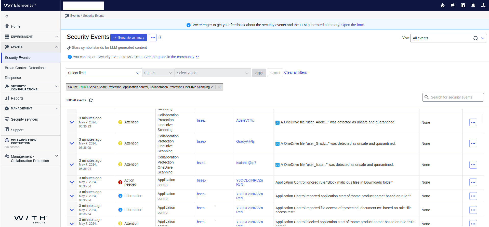

# Sentinel Connector with Azure Function

Sentinel Connector allows ingesting WithSecure Security Events into Microsoft Sentinel Logs
Workspace. Connector periodically polls Security Events from Elements backends and forwards 
it to Azure cloud. 

Sentinel administrator can use ingested events to create Workbooks, 
Playbooks and use other Sentinel features.

## Installation

Repository provides packages that help install Connector in Azure cloud. **[Installation Guide](docs/installation_guide.md)** 
contains step-by-step installation procedure that will help you start ingesting WithSecure 
Security Events.

Contact [WithSecure support](https://www.withsecure.com/en/support) if you need more detail or help with installation.

## Development

### Requirements

- Python 3.10.x
- Poetry (https://python-poetry.org/)
- Azure CLI (https://learn.microsoft.com/en-us/cli/azure/)

### Project structure 

- `app/function_app.py` - entry point for Azure Function
- `app/lib/` - connector implementation responsible for reading data from Elements API and
   pushing data to Azure Log Workspace
- `deploy/` - Azure ARM deployment templates
- `tests/` - unit tests
- `scripts/` - additional scripts that can be executed from poetry
- `poetry.toml` - poetry configuration
- `pyproject.toml` - project configuration (dependencies, additional tools, scripts, etc)

### Building installation package

1. Run `poetry install --only main --remove-untracked` to install connector's dependencies 
   in local `.venv` virtual environment. When `--only main` is present poetry will skip 
   development dependencies (`black`, `pytest`, etc).
   
2. Run `poetry run dist-app`. Command creates deployment package `app.zip` in `target` 
   directory.

### Connector installation

1. Run command `az functionapp deployment source config-zip --resource-group $resource_group --name $azure_function --src target/app.zip`

2. Use command `az functionapp show --resource-group $resource_group --name $azure_function` 
   to get function details. Find property `lastModifiedTimeUtc` to verify last modification 
   date.
3. Wait until new events arrive in table `WsSecurityEvents_CL`.

### Testing

1. Tests are kept in directory `tests/`. To execute whole suite run command `poetry run pytest`.
2. Run `poetry run pyflakes app/` to verify program correctness.

### Formatting

Execute `poetry run black .` to format all files in directory

### Local Run

Simplest way to test and run function locally is to use VS Code with following extensions:

* [Python](https://marketplace.visualstudio.com/items?itemName=ms-python.python)
* [Azure Functions](https://marketplace.visualstudio.com/items?itemName=ms-azuretools.vscode-azurefunctions)
* [Azurite V3](https://marketplace.visualstudio.com/items?itemName=Azurite.azurite)

Start with verifying installation of Azure Functions Core Tools. In VS Code press `F1` then start command:

    Azure Functions: Install or Update Core Tools

Then next step is to start Azure emulator. In VS Code press `F1` and run command

    Azurite: Start

Running services should appear on the bottom status bar in VS Code.

To start function in emulator it needs to be appended to Azure Functions. To do so go to **Run and Debug** and select
**Attach to Python Functions** or simply use shortcut `F5` in VS Code. Function should automatically start locally.

To learn more visit:
[Quickstart: Create a function in Azure with Python using VS Code](https://learn.microsoft.com/en-us/azure/azure-functions/create-first-function-vs-code-python?pivots=python-mode-decorators)
