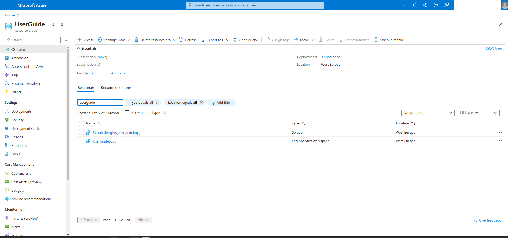
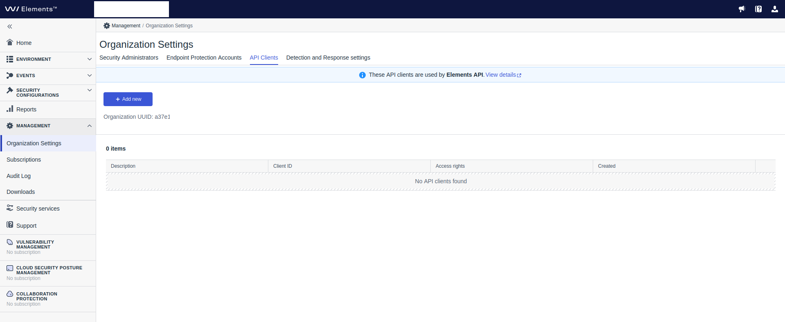

# Installation guide

This guide provides step-by-step procedure of installing WithSecure data connector for 
Azure Sentinel.

## Prerequisites

1. Access to Azure account with installed Sentinel solution.
2. Workstation with installed [Azure CLI](https://learn.microsoft.com/en-us/cli/azure/).
3. Access to [WithSecure Elements Security Center](https://elements.withsecure.com).

### Installation

Connector installation has following steps:

1. Get installation package.
2. Create Elements API credentials
3. Create Azure Entra application.
4. Deploy Azure resources.

Log Analytics Workspace is not managed with provided deployment templates. It can be created
manually in Azure Portal or from command line. All resources that are mentioned in this 
guide must be deployed in the same resource group where the Log Analytics Workspace is 
created. For purpose of this guide in next paragraphs we will be using example resource 
group called `UserGuide`. Initially it only contains Log Analytics Workspace called 
`UserGuideLogs` and Sentinel solution.

#### Get installation package

#### Create Elements API credentials

Connector polls Security Events from WithSecure Elements backend therefore before 
installation administrator must create API credentials in [Elements Security Center](https://elements.withsecure.com/apps/ccr/api_keys).

1. Go to Elements Security Center. Use [direct link](https://elements.withsecure.com/apps/ccr/api_keys)
   that will automatically open API credentials management page or open `Organization Settings` 
   in `Management` section and go to `API clients` tab. Only administrators with full EPP 
   permissions are permited to manage API credentials.
   
   

2. Click button `Add new` and enter description of new credentials pair. If you plan to use 
   Elements API for managements (for example blocking devices or triggering remote 
   operations) then uncheck `Read-only` field. Click button `Add`.
   
3. After new credentials pair is added you can copy `Client ID` and `Secret` to file `connector_app_parameters.json`. 
   Put `Client ID` as value of `elementsApiClientId` and `Secret` as value of `elementsApiClientSecret`.

#### Create Azure Entra application
