# Installation guide

This guide provides step-by-step procedure of installing WithSecure data connector for 
Azure Sentinel.

## Prerequisites

1. Access to Azure account with installed Sentinel solution.
2. Workstation with installed [Azure CLI](https://learn.microsoft.com/en-us/cli/azure/).
3. Access to [WithSecure Elements Security Center](https://elements.withsecure.com).

### Installation

Connector installation has following steps:

1. Get installation package.
2. Create Elements API credentials
3. Create Azure Entra application.
4. Deploy Azure resources.
5. Verify installation.

Log Analytics Workspace is not managed with provided deployment templates. It can be created
manually in Azure Portal or from command line. All resources that are mentioned in this 
guide must be deployed in the same resource group where the Log Analytics Workspace is 
created. For purpose of this guide in next paragraphs we will be using example resource 
group called `UserGuide`. Initially it only contains Log Analytics Workspace called 
`UserGuideLogs` and Sentinel solution.


#### Get installation package

Installation package provides [ARM template](https://learn.microsoft.com/en-us/azure/azure-resource-manager/templates/) 
that deploys WithSecure Elements API connector in Azure portal. Download installation 
package from [github.com](https://github.com/WithSecureOpenSource/elements-api/releases/download/1.0.1/install.zip)
and extract archive in preferred localization. Directory `ws_connector/deploy` contains two 
files:
 - `azuredeploy_connector_app.json` - ARM template that deploys all required resources in
   given resource group. Deployment can be customized with temaplate's parameters. 
   If non-required parameter is not specified during a default value will be used:
   - `workspaceName` (required) - name of Log Analytics Workspace,
   - `elementsApiClientId` (required) - Elements API client id,
   - `elementsApiClientSecret` (required) - Elements API client secret,
   - `entraClientId` (required) - Entra application client id,
   - `entraClientSecret` (required) - Entra application client secret,
   - `entraTenantId` (required) - Entra application tenant id,
   - `entraObjectId` (required) - Entra application principal id,
   - `engine` - list of Security Event engines as described in [Elements API documentation](https://connect.withsecure.com/api-reference/elements#post-/security-events/v1/security-events), 
     for example `deepGuard`,
   - `engineGroup` - list of Security Event engines as described in [Elements API documentation](https://connect.withsecure.com/api-reference/elements#post-/security-events/v1/security-events), 
     for example `edr`. By default connector polls all supported Security Events
 - `connector_app_paramters.json` - deployment parameters used with Azure CLI.

#### Create Elements API credentials

Connector polls Security Events from WithSecure Elements backend therefore before 
installation administrator must create API credentials in [Elements Security Center](https://elements.withsecure.com/apps/ccr/api_keys).

1. Go to Elements Security Center. Use [direct link](https://elements.withsecure.com/apps/ccr/api_keys)
   that will automatically open API credentials management page or open `Organization Settings` 
   in `Management` section and go to `API clients` tab. Only administrators with full EPP 
   permissions are permited to manage API credentials.
   
   

2. Click button `Add new` and enter description of new credentials pair. If you plan to use 
   Elements API for managements (for example blocking devices or triggering remote 
   operations) then uncheck `Read-only` field. Click button `Add`.
   
3. After new credentials pair is added you can copy `Client ID` and `Secret` to file `connector_app_parameters.json`. 
   Put `Client ID` as value of `elementsApiClientId` and `Secret` as value of `elementsApiClientSecret`.

#### Create Azure Entra application

Entra application is responsible for authentication and authorization in communication
between Elements Connector and Azure Log Analytics Workspace. Azure administrator must
create Entra application before deploying connector.

1. In Azure portal go to `Microsoft Entra ID` and open `App registrations` from left menu.
   
   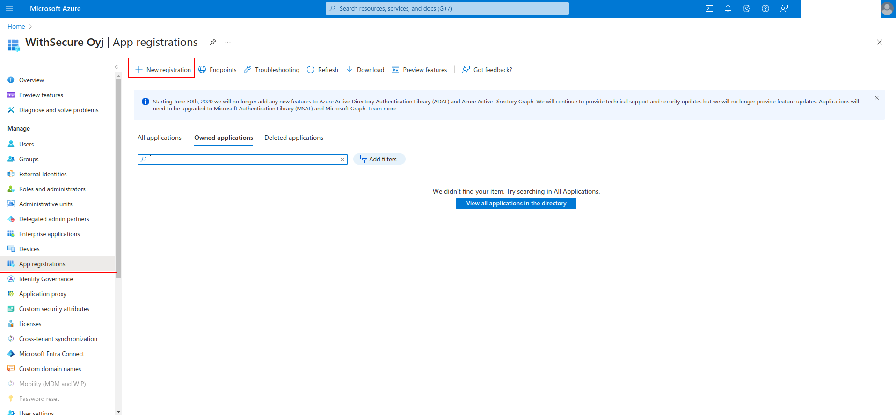

2. Click button `New registration`. In field `Name` enter name of application, for example 
   `UserGuideApp` and click button `Register`.
   
   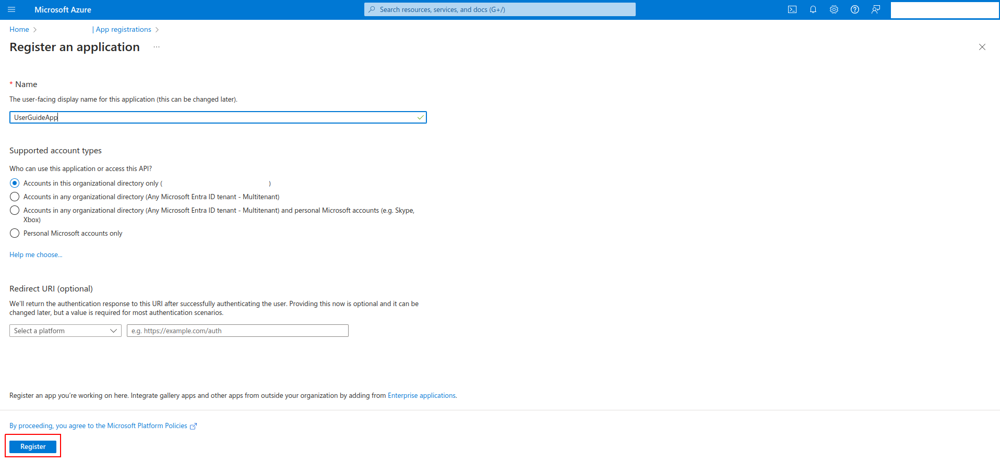

3. Click on application name in the list to open details of new Entra application.
   
   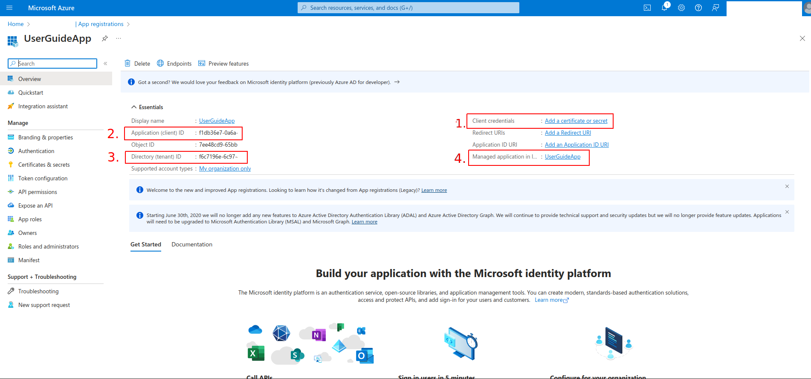

4. Find row with label `Client credentials` (red square with number `1.` on screenshot) and
   click link `Add a certificate or secret`.
   
5. Click on button `New client secret`. Enter client secret description, for example 
   `UserGuideSecret` and click button `Add`
   
   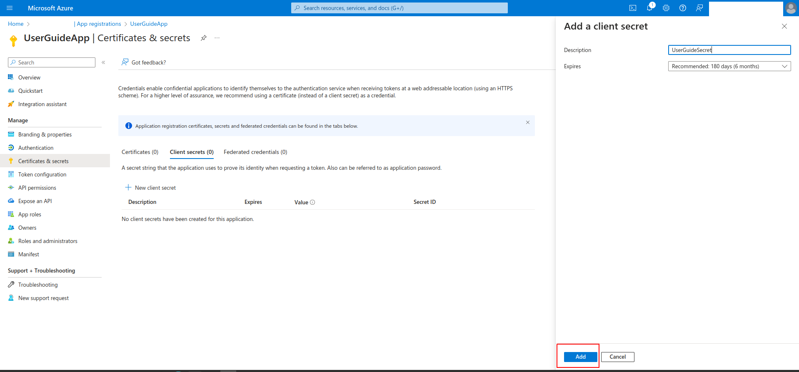

6. From secrets list copy value in column `Value` to parameter `entraClientSecret` in file 
   `connector_app_parameters.json`. Secret value will be hidden after page refresh.
  
   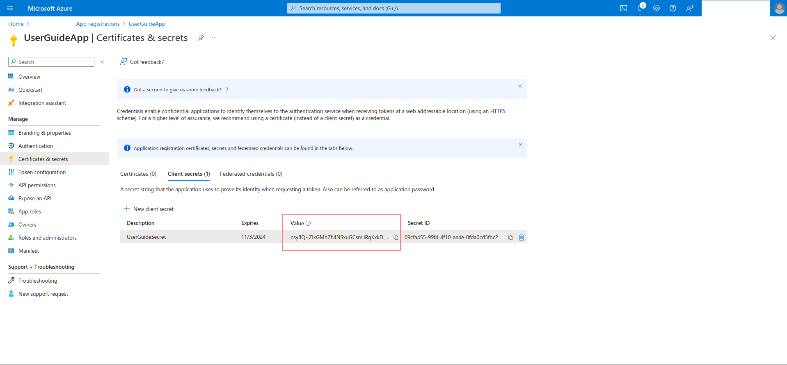
   
7. Back to details of `UserGuideApp`. Copy value from row `Application (client) ID` to 
   parameter `entraClientId` and value from row `Directory (tenant) ID` to parameter 
   `entraTenantId` in file `connector_app_parameters.json`. 
   
8. Find row with label `Managed application in local directory` (red square with number `4.` 
   on screenshot) and click link with application name.
   
9. Copy value from field `Object ID` to parameter `entraObjectId` in file `connector_app_parameters.json`.

#### Deploy Azure resources

WithSecure Elements API connector is implemented as Azure Function App. Azure ARM template
from file `azuredeploy_connector_app.json` deploys all required resources:
 - Function App with Application Insights,
 - Data Collection Rule,
 - Data Collection Endpoint,
 - Storage Account.
 
 ARM template can be deployed from command line. Before deployment check 
 `connector_app_paramters.json` and ensure that all parameters have values describe in
 previous sections of this guide.

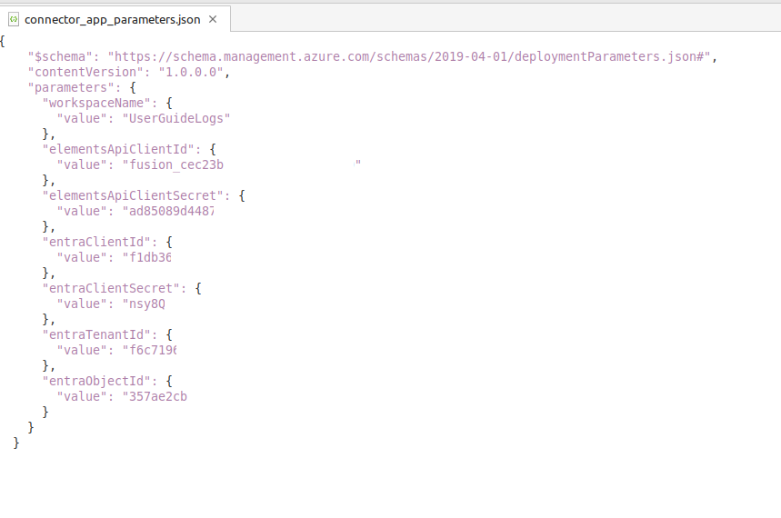

 In command line go to directory `ws_client/deploy`, execute command 
 `az deployment group create -n ConnectorApp -g UserGuide -f azuredeploy_connector_app.json -p connector_app_parameters.json` 
 and wait until execution finish. Remember to replace `UserGuide` with name of resource
 group with your Sentinel solution.
 
#### Verify installation

Go to resource group with Sentinel solution. After successful deployment it should contain 
items similar to ones from screenshot below.

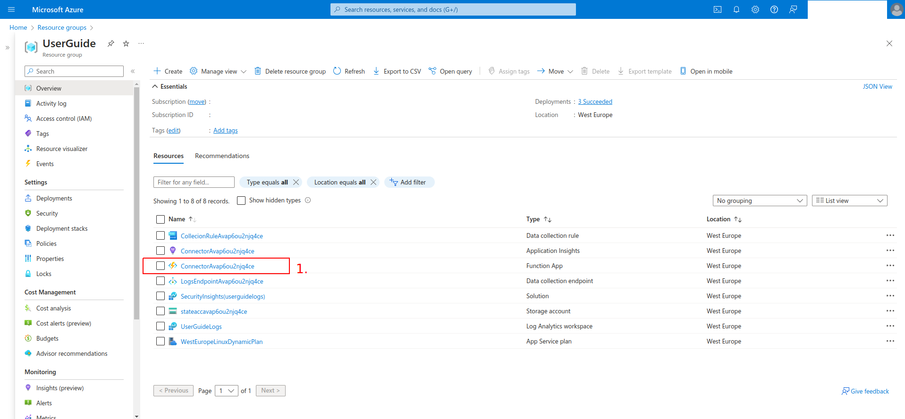

After deployment connector starts polling Security Events from Elements backend. Every
minute reads most recent events and push to table `WsSecurityEvents_CL` in Log Analytics 
Workspace. **WARNING: Connector skip Security Events that were created BEFORE installation**

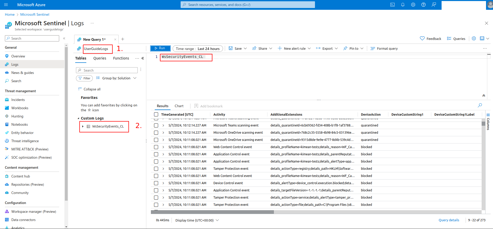

To check table go to your Sentinel solution and open `Logs` view. Expand node `Custom Logs`.
If `WsSecurityEvents_CL` is visible then double click on table. Click button `Run` to fetch 
ingested events.

Missing or empty `WsSecurityEvents_CL` might indicate that connector can't read Security 
Events or ingest to Log Analytics workspace. Connector logs can be checked in Azure 
Function App console. 

1. Go to `UserGuide` resource group.

2. On list find item of type `Function App` and name with prefix `Connector` (red square on 
   screenshot). Click on item to open details view.
   
   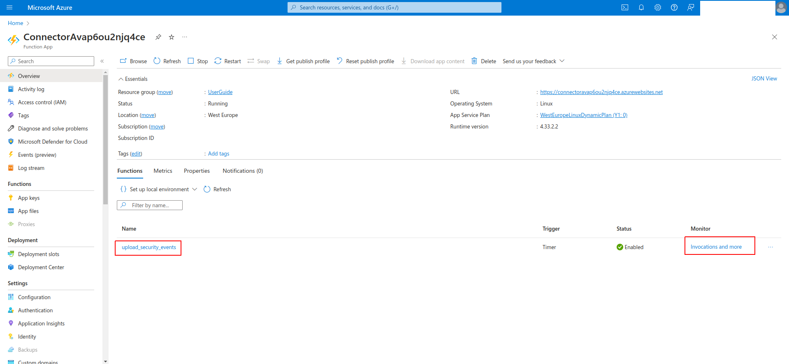
   
3. In details view in tab `Functions` find row with name `upload_security_events`. Click
   on link `Invocations and more` in column `Monitor`.
   
4. Every row in table represents single connector executions. Exception in execution logs
   might indicate either communication errors, such as invalid credentials or other 
   unexpected conditions. If you need help from [WithSecure support](https://www.withsecure.com/en/support)
   remember to provide full exectution log.
   
   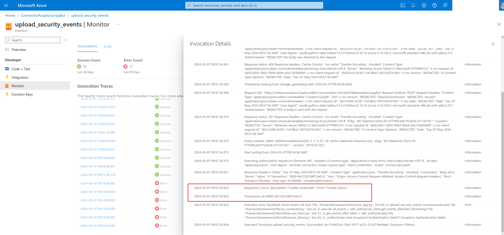
   
5. To check last execution you can also run Application Insights query. 
   ```
   traces
   | where timestamp > ago(30d)
   | where operation_Name =~ 'upload_security_events'
   | where message contains "Found" or message contains "Error"
   | order by timestamp desc
   | take 200
   ```
   Message that starts with `Found 0 items since $DATE` indicates that connector didn't found 
   any new items since `$DATE`.
   
   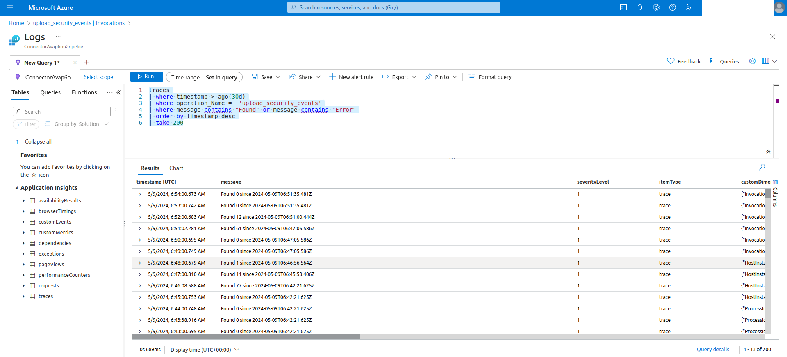

If you need more help with connector you can try contact [WithSecure support](https://www.withsecure.com/en/support).
